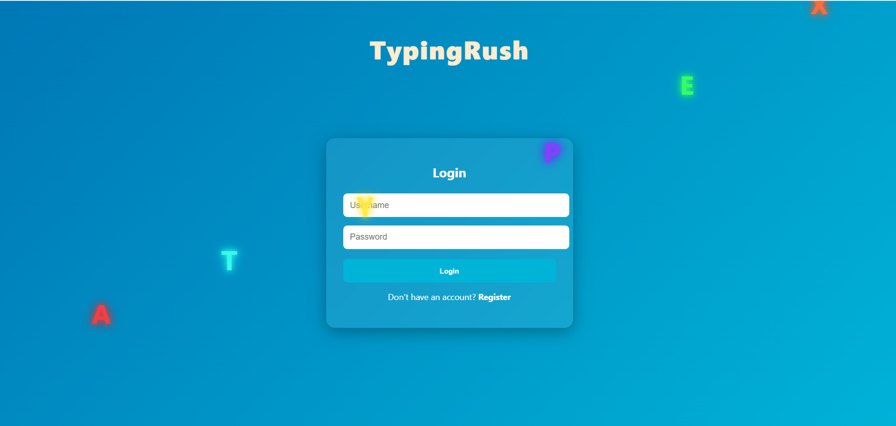
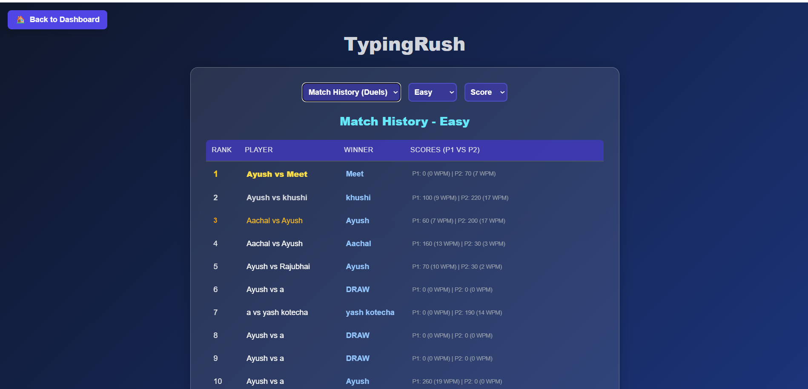
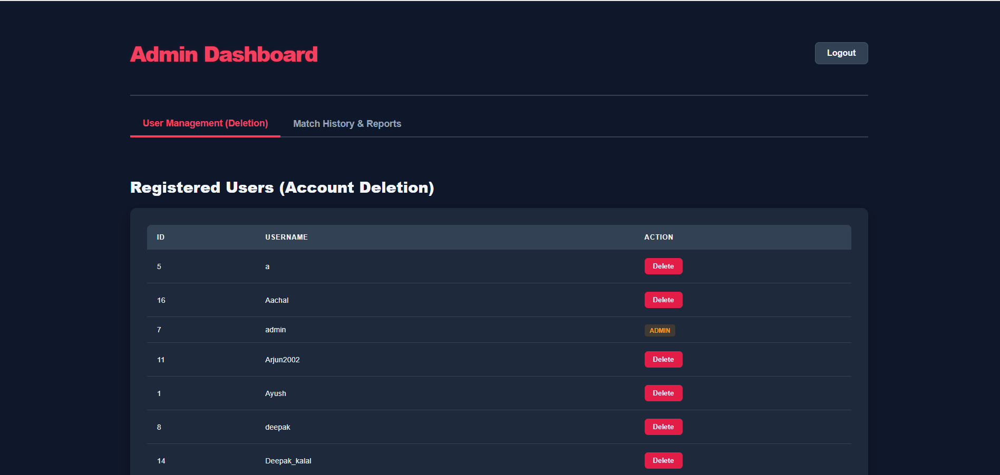

# 🚀 TypingRush — Real-Time Multiplayer Typing Game

> A full-stack real-time typing game with multiplayer battles, leaderboard analytics, and admin reporting system.

---

## 🌐 Live Demo

* 🖥 Frontend: https://typing-rush-mu.vercel.app
* ⚙ Backend API: https://typing-rush.onrender.com

---

## 🎯 Highlights

* ⚡ Real-time multiplayer gameplay (Socket.IO)
* 🏆 Dynamic leaderboard with multiple ranking metrics
* 🔐 Secure authentication using JWT
* 📊 Admin dashboard with reports & filtering
* 🌍 Fully deployed full-stack app (Vercel + Render + Railway)

---

## 🖼️ Screenshots

📌 Create a folder named `screenshots` in your repo and add images with these names.

### 🔐 Login Page



### 📝 Register Page


### 🎮 Gameplay (Single Player)


### ⚔ Multiplayer Match


### 🏆 Leaderboard



### 🧑‍💼 Admin Dashboard



---

## ⚙️ Tech Stack

### 🧩 Frontend

* HTML, CSS, JavaScript (ES Modules)
* Hosted on Vercel

### 🔧 Backend

* Node.js + Express
* Socket.IO (real-time communication)
* JWT Authentication
* Hosted on Render

### 🗄️ Database

* MySQL (Railway)

---

## 🧠 System Architecture

```text
Frontend (Vercel)
        ↓
Backend API + WebSockets (Render)
        ↓
MySQL Database (Railway)
```

---

## 🔥 Features

### 👤 Authentication

* Register / Login system
* JWT-based authentication
* Session handling (single-device login)

---

### 🎮 Gameplay

* Single-player typing mode
* Multiplayer real-time battles
* Difficulty levels: Easy / Medium / Hard
* Live scoring system
* WPM & streak tracking

---

### 🏆 Leaderboard

* Global rankings
* Supports:

  * Score
  * WPM
  * Streak
* Multiplayer match history

---

### 🧑‍💼 Admin Panel

* View all users
* Delete users
* Match history reports
* Date-wise filtering
* Activity tracking


---

## 🚀 Local Setup

### 1️⃣ Clone Repository

```bash
git clone https://github.com/your-username/typingrush.git
cd typingrush
```

### 2️⃣ Install Backend Dependencies

```bash
cd backend
npm install
```

### 3️⃣ Create `.env`

```env
DB_HOST=localhost
DB_USER=root
DB_PASS=yourpassword
DB_NAME=typingrush
DB_PORT=3306
JWT_SECRET=your_secret

---

## 🧪 API Endpoints

| Method | Endpoint         | Description            |
| ------ | ---------------- | ---------------------- |
| POST   | /register        | Register user          |
| POST   | /login           | Login user             |
| POST   | /logout          | Logout                 |
| POST   | /save_score      | Save score             |
| POST   | /log_match       | Save multiplayer match |
| GET    | /get_leaderboard | Fetch leaderboard      |
| GET    | /getWords        | Fetch typing words     |

---

## 🔌 Socket Events

* sendInvite
* acceptInvite
* rejectInvite
* playerFinished
* matchEnd
* gameUpdate

---

## ⚠️ Notes

* Backend hosted on Render (may sleep on inactivity)
* Uses Wikipedia API for dynamic word generation
* Real-time multiplayer depends on stable network

---

## 🚀 Future Improvements


* 📱 Mobile optimization
* 🎨 UI/UX enhancements
* 💳 Premium features

---

## 👨‍💻 Author

**Ayush**

---

## ⭐ Support

If you like this project, give it a ⭐ on GitHub!
